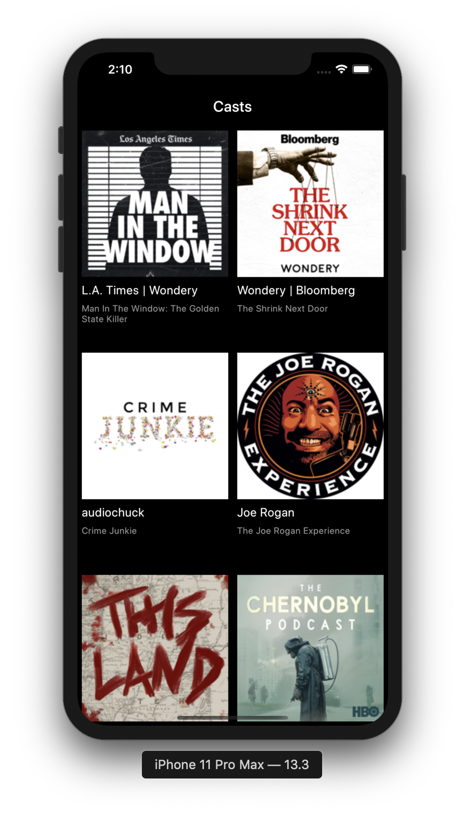
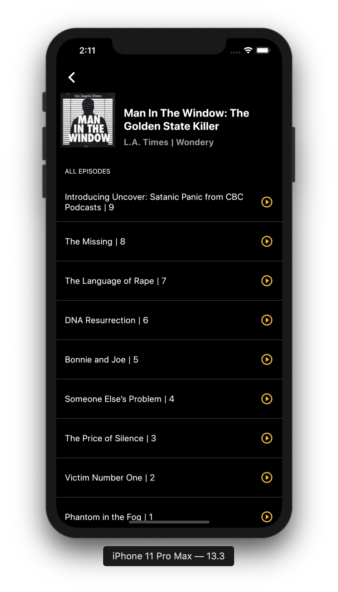
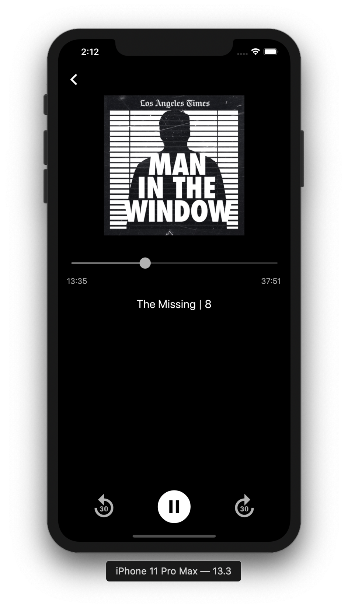

# 🎧 PodStream – Flutter Podcast App

PodStream is a minimal yet powerful Flutter-based podcast app that allows users to listen to their favorite shows and upload episodes to their own channels. Designed with a clean UI and seamless UX, it simplifies both content consumption and distribution.

Please ⭐ star the repo if you find it helpful!

## 💻 Requirements

- Any Operating System (Windows, macOS, Linux)
- Flutter SDK installed
- IDE like Android Studio, VSCode, etc.
- Basic knowledge of Dart & Flutter

## ✨ Features

- 🎙️ **Upload Podcasts** – Upload episodes to your personal or public channels  
- 📚 **Podcast Library** – Browse and play available shows and episodes  
- ⏯️ **Play Controls** – Clean audio interface with play/pause and seek options  
- 🧩 **Minimalist UI** – Smooth and clutter-free interface  
- 🔍 **Search & Filter** – Easily find episodes by title or description  
- 📱 **Responsive Layout** – Works across mobile and tablet devices  

## 📸 Screenshots

<!-- Add your screenshots to the /ss folder and use this layout -->

<!-- 
| App UI |
|--------|
|  |
|  |
|  |
-->

## 🔌 Technologies Used

| Package                              | Purpose                                  |
|--------------------------------------|------------------------------------------|
| **Flutter**                          | Cross-platform app development           |
| **Bloc**                             | Scalable state management                |
| **Dio**                              | Networking and API calls                 |
| **Firebase**                         | Authentication and cloud storage         |
| **Fimber**                           | Lightweight logging utility              |
| **GraphQL**                          | Flexible data querying and mutations     |

## 🤓 Author

**Samama Hussain**  
[GitHub Profile](https://github.com/SamamaHussain)
 
